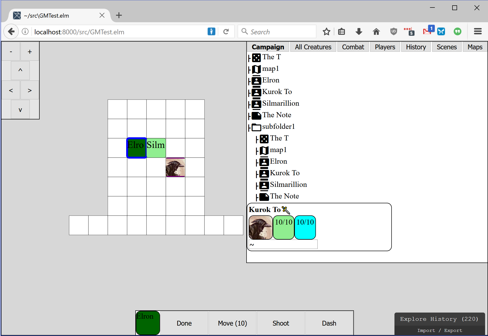

# P&T

P&T (name to be changed) will be an extensible digital game system for table-top roleplaying.

What does that mean? Well, think about Pathfinder, HERO, or Dungeons & Dragons: traditional table-top games. Now, imagine that all of their features and systems are implemented as an app on your laptop, phone, or tablet. P&T aims to be something like that.

It's important to note that P&T is *not* just an implementation of some existing ruleset: it's a completely new system. In fact, it's not even really a game system, but a game engine that systems can be built on. The games will come later. Let me reiterate: P&T is not an implementation of D&D, Pathfinder, or any other system, and it doesn't aim to support those systems.

# Status

P&T is really very early in development. It can't be used to run games yet. Still, I've been working on it for a while now, nearly full-time, and I've decided to start making releases mostly as a way to have a dev blog of sorts -- I wanted to start documenting my progress both for my own amusement and motivation, and to maybe drum up some interest in my project.

# Recent Developments

## Campaign Tree

Most recently I have been working on the "Campaign" view -- this is going to be the main way that a GM organizes and finds things in their games. All battle maps, scenes, creatures and notes will be laid out in a folder tree in this view.

There's still a lot of work here, and a lot to figure out. Right now, the folder tree doesn't "own" the objects that it contains -- everything is sitting in a big pool elsewhere, and the campaign tree just "links" to those maps, scenes, creatures etc. That means that all of those things can be linked at multiple places in the tree, or even nowhere at all. This may need to change, either by really making the folder own the objects (to avoid confusion about things being linked in multiple places, or unlinked but still existing), or by making the linking system less error-prone (don't allow deleting the last link to an item, make sure the user really wants duplicate links if they're trying to do that).

In addition to that, I have the following things on my todo list related to campaigns:

- create creature in a folder
- delete/unlink things from folders
- edit notes in folders

## Other Developments

Campaigns have been taking my time for the past several days, but since this is my first dev log, I figure I should include a basic rundown of what P&T can do so far.

- **Creatures:** Creatures have names, health, movement speed, conditions, and classes.
- **Conditions:** Conditions are a set of specific modifiers that apply to a creature, such as:
  - damage boost (not implemented)
  - recurring effect applied on every one of the creature's turns (implemented)
  - health buff (not implemented)
- **Classes:** A class defines what abilities a creature has, can also include a set of permanent conditions.
- **Abilities:** An Ability has a target "specification" (melee, ranged(500), etc) and an associated Effect to apply to their target.
- **Effects:** An Effect is some specific thing that can happen to a creature, such as Damage, Heal, or Apply Condition.
- **Scenes:** A scene is the combination of a battle-map and a set of creatures. Combat is also scoped to a scene, so a combat can only take place in one scene at a time.
- **Battle Maps:** There is a terrain map system with a super-basic grid of 1x1 meter squares which creatures can occupy. The terrain system is currently 2d and only supports one bit of info: passable or non-passable.
- **Pathfinding:** There is a pathfinding system implemented, so you only have to click your character and then click where you want it to move. One part that I'm particularly proud of is that when you click a character, it calculates *all possible* movement options for you and highlights them so you know where you can move. This is based on the creature's speed.
- **Combat:** There's a combat system with turn orders, very basic action economy (Abilities can consume Energy which is restored on your next turn), and movement economy (you can move up to your speed).
- **Multiplayer network communication:** The web interface has push notifications and players can log on and be granted control of their creatures so they can move them in and out of combat, and all of actions are synchronized in real time with the other clients.

That's pretty much it.

## Where from here?

There's an unimaginable amount of work left to do on P&T before it's ready to run an actual game, though I have started using it solely for its battlemap during my traditional tabletop RPG games to put it through its paces.

**Modules:** Once I'm done with campaign management and it seems usable, I'd like to add a system for "Adventure Modules", which are basically a way to bundle up a campaign as a reusable thing and distribute it to GMs.

**Game System Prototyping:** I'm really not much of a game designer, but I have a number of actual game features that I'd like to implement, mostly as a way to ensure the flexibility of the core engine. For example: a "sneak attack" ability that grants a bonus to damage if an ally is flanking your enemy. This will require extending Effect execution to allow it to query the map, which is currently impossible. Or a "rough terrain" system which makes movement through certain squares slower than others (which should have interesting effects on pathfinding).

## End

Thanks for reading, if you have! If you have any interest in a project like this, either as a writer, artist, system designer, programmer, or playtester, please give me a shout at pandt@wordeology.com.
