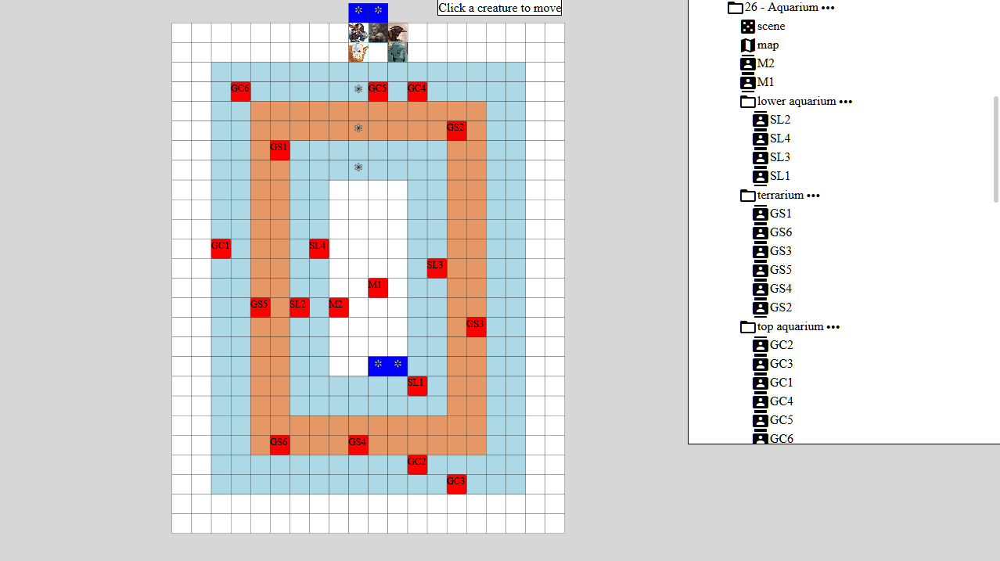

# P&T Dev Log 2017-05-18

Yeesh, it's been about a month and a half since my [previous dev log](../2017-03-27/README.md). I admit, development has slowed in that time period, but a lot of features and fixes have still accumulated. Here's what I'll cover in this log:

- Volume/Area effects
- Map navigation with mouse and mobile touch
- Improved mobile UI
- Map notes and highlighted map tiles
- Optimizing Elm programs
- Implementing White Plume Mountain in P&T

# What is P&T?

P&T (name to be changed) will be an extensible digital game system for table-top roleplaying.

What does that mean? Well, think about Pathfinder, HERO, or Dungeons & Dragons: traditional table-top roleplaying games. Now, imagine that all of their features and systems are implemented as an app on your laptop, phone, or tablet. P&T aims to be something like that.

It's important to note that P&T is *not* an implementation of some existing ruleset: it's a completely new system. In fact, it's not even really a game system, but a game engine that systems can be built on. The games will come later. Let me reiterate: P&T is not an implementation of D&D, Pathfinder, or any other system, and it doesn't aim to support those systems.

P&T is really very early in development. It can't be used to run games by itself, but it offers useful campaign-management tools and a tactical battle map, which I'm already using in practice.

# Recent Developments

## Volume/Area effects

*Summary:* Basic AoE abilities are now possible with a volume-targeting system.

Abilities that affect an entire volume of space are an important part of tabletop role-playing. The "Fireball" spell is a classic example. I spent a lot of time implementing these and, to some extent, polishing the UI for activating them.

In P&T, Creatures have Abilities, and Abilities have a TargetSpec, which defines how targets must be specified when using that ability. The most commonly used TargetSpecs are `Melee` and `Range(Distance)`. There's also `Actor` TargetSpec for abilities that only target the user. Since the last update, I've implemented `AllCreaturesInVolumeInRange{volume: Volume, range: Distance}`, which makes it possible for an ability to have its affects applied to all creatures in an arbitrary volume. 

But what is `Volume`? Right now, I've only implemented `Sphere(radius: Distance)` (e.g. Fireball), but `LineFromCaster(range: Distance)` will be an important one to implement for abilities like Lightning Bolt. Others might be `VerticalColumn(range: Distance, radius: Distance)` for an ability like "Blast from the heavens", or `Line(range: Distance, max_length: Distance)` for an ability that lets you conjure an invisible wall.

Another important type of TargetSpec will be `TargetSpec::Volume{volume: Volume, range: Distance}`. This will allow defining abilities that affect *volumes themselves* instead of creatures within a volume. This is for persistent area effects like oil-slicks or magical grasping vines. Still TBD, though!

### Area-effect UI

As usual, implementing the UI took longer than the game logic, but I'm happy that I have a fairly usable interface with good visible feedback. Here's a video of me using Silmarillion's Fireball ability.

Things you might notice in this demo:

- After you click or tap a target, it shows both the area affected in pink, and highlights the creatures in that area in red.
- You can then decide to click somewhere else, before confirming the ability, to affect a different area.
- The fireball can affect tiles through unpassable terrain. I still need to implement line-of-sight checks to determine where these AoE abilities "spread". I'll also probably need to implement different TargetSpecs for AoE abilities that can spread around corners (like fireballs classically do) and others which don't (like a blinding flash ability).

## Map navigation with mouse and touch controls

*Summary:* It's now possible to easily drag the map around with your finger or mouse, thanks to svg-pan-zoom.js and hammer.js.

I had been thinking about this and evaluating different ways to do it for quite a while. For some time I was considering implementing this behavior from scratch in Elm, but there are just too many concerns to make that feasible, so I ended up using the excellent [SVG Pan & Zoom](https://github.com/ariutta/svg-pan-zoom) JavaScript library. This required understanding how Elm/JavaScript interaction worked to a reasonably low-level, especially since this library deals with the DOM nodes that my Elm code renders. I also had to incorporate [Hammer.JS](http://hammerjs.github.io/) to support touch screens.

This was pretty tedious to implement, since it involved testing on a number of platforms, where I saw differences in behavior in each one. The browsers I tested were Firefox (Windows), Chrome (Windows), Chrome (Android), and Safari (iOS). In the end I wrote a small JavaScript module ([PanZoom.js](https://github.com/radix/pandt/blob/68e35b6099109feb8d055632cfb4b2d6117e24bc/ptui/src/PanZoom.js)) and Elm module to interact with it ([PanZoom.elm](https://github.com/radix/pandt/blob/a0a279bc7ec921c4864f75fb95617c83999c24c0/ptui/src/PanZoom.elm)).

I had to work around some tricky issues with JavaScript event ordering, especially since the SVG which I'm applying the pan/zoom code to also wants to handle clicks (for example, clicking a character to move it, or clicking a tile to target a spell). The note in PanZoom.js, linked above, describes that in more detail.

All that done, it's working quite nicely now! Here's a demo:

## Improved Narrow UI

*Summary:* The UI now renders differently on narrow screens, making the experience on portrait-mode phones much better.

I spent some time improving the UI, since I noticed it was pretty terrible, especially on a portrait-mode phone. When the screen width is lower than a threshold, the view switches from having the map in the "background" with a tabbed sidebar, to making the "sidebar" fill the entire screen and move the map into a tab. I had to learn about CSS's `transform: scale()` directive, and [this article by Chris Coyier on CSS-Tricks](https://css-tricks.com/scaled-proportional-blocks-with-css-and-javascript/) was very helpful to me. Not only did I make the sidebar fill the entire width of the screen, I scaled up the content inside of it so that it was actually legible/navigable.

Here's the demo!

## "Special" map tiles & annotations

*Summary:* It's possible to put colored tiles with notes on your maps, visible to your players or just the GM.

One of the features I talked about wanting to work on in my last dev log was "Map annotations", and I'm happy to say that I've now implemented them. When editing a map, the GM can paint "special" tiles instead of just the usual terrain. When painting a special tile, you can choose the color that it will be rendered as, and whether it should have a note attached to it. In addition, you can specify whether it should be visible to the GM only, or All Players. This is helpful if you need to keep track of secrets in your maps.

The UI is still extremely primitive, and there's a lot of rework I want to do here. Here's a quick demo.

These special tiles don't affect whether terrain is open or not, so you can put them both in inaccessible parts of the map, or on top of open terrain that the players can walk through. As the video shows, players can click these tiles to show the annotation.

## Optimizing Elm UI

*Summary:* I made the UI much faster.

A couple weeks ago, I was getting extremely frustrated with the performance of the P&T UI. After spending a ton of time figuring out the extremely under-documented and hacky "lazy" VirtualDOM system that Elm provides, I realized that the biggest part of my performance problems were because I was using the "Elm Reactor", a development tool that automatically recompiles code when it changes, which is very handy. The problem was, it also enables some very high-overhead debugging code when you're running your app -- it keeps track of all model changes while your app is being used. This means that for every letter you type into a text field, it's doing a lot of extra work with your model state.

Once I realized that it was slowing my app down significantly, I wrote my own custom file-watching build tool that takes advantage of the excellent `watchexec` tool, which is written in Rust and supports all the major desktop platforms.

However, I was still running into some performance issues. To understand why, it's important to know how Elm (and other model-view-update frameworks) work. Basically, every time your model changes, the entire view is re-rendered with a pure function. This is an elegant system in that it avoids any kind of accidental statefulness in your UI widgets, but it also means that you might be re-rendering parts of the UI that are completely unrelated to a model change. Since even things like text entry strings are stored in the model, every time you type a letter into any text box, the entire app's view is re-calculated. My SVG-based map can get into the tens of thousands of nodes, and even though Elm makes use of a Virtual DOM, it was still taking a lot of time to evaluate all of those nodes, just so that they could be thrown away since they were equal to what was already in the rendered DOM.

Frameworks like [React](https://facebook.github.io/react/) have a concept of "Components", which give you easy boundaries at which to reason about caching logic, along with a [method you can override](https://facebook.github.io/react/docs/react-component.html#shouldcomponentupdate) to determine whether a component should be re-rendered. Elm, on the other hand, encourages a monolithic structure where the model is very flat and there is no separation between "components". This means that there is no obvious boundary at which to cache.

It does, however, provide a module called [Svg.Lazy](http://package.elm-lang.org/packages/elm-lang/svg/2.0.0/Svg-Lazy), which is itself just an alias to the [VirtualDOM lazy functions](http://package.elm-lang.org/packages/elm-lang/virtual-dom/2.0.4/VirtualDom#lazy). These few functions basically memoize your own view-generating functions, remembering what arguments they're given and caching their results, and checking if the arguments are the same on successive calls to the function. Sadly, this is implemented in a way that relies on "memory identity" of the arguments, so even if the arguments are equal, the caching behavior may not be triggered. This isn't a concept that is ever exposed to Elm programmers anywhere else, and in fact the semantics aren't defined anywhere. You pretty much have to read the underlying JavaScript code to understand what is going on, and also understand how Elm constructs objects.

## Implementing White Plume Mountain in P&T

*Summary:* I created maps in P&T for all the areas in the classic adventure White Plume Mountain, which was a useful exercise in "eating my own dog food".

As I've mentioned in past dev blogs, I play in a weekly Dungeons and Dragons group, where I am the Dungeon Master. I have been using P&T's tactical combat map in these games as a way to eat my own dog food, and it's certainly helped quite a lot (I didn't really know how slow my app was until I tried creating some larger rooms in the map editor).

We're starting to go through the classic adventure [White Plume Mountain](https://en.wikipedia.org/wiki/White_Plume_Mountain) as ported to 5th Edition D&D in the excellent [Tales from the Yawning Portal](http://dnd.wizards.com/products/tabletop-games/rpg-products/tales-yawning-portal). I decided that I would use P&T's campaign management tools to represent the scenes in this adventure, and use the tactical map to play through all of them with my group. It's certainly the most thorough use of P&T so far, and it revealed a good number of UX flaws which I've partially resolved.

- The most notable one was the performance problem I described above; especially when creating the larger rooms in this adventure, the UI would slow to a crawl. That's now happily resolved.
- Another minor UI improvement was making it obvious that some special tiles are only visible to the GM -- I was getting confused as to whether some specials were for the entire party to see, or just for my own use. I improved that marginally by putting parentheses around the special notes, but this could be visually improved.

There are still some other things to improve:

- Creating multiple creatures is tedious, especially when they are identical in all but name. A simple way to resolve this would be to just allow creating an arbitrary number of duplicate creatures at once with an input box to let the GM enter how many copies to make. However, I also clearly need to make it possible to define Classes (or "Monster Types") through the user interface, and allow an easy way to create multiple copies directly.

# Where from here?

I keep track of my todo lists using [GitHub's "Projects" feature](https://github.com/radix/pandt/projects/), but I also tend to work on whatever is bothering me most at the moment. At this point in the project's development, that's fine, since everything I'm working on is probably a critical feature in the long-run. However, some of the overarching things I've been thinking about are:

- **Creature Size**: I mentioned this in my last dev log, and it's still something that I want to get done. This is particularly important for running my D&D game, since we often go up against creatures of non-Medium size, and it's awkward to have to keep telling my players "pretend that this tile is bigger, down and to the right".

- **Adventure Modules**: I think that supporting flexible loadable modules is critical to the success of P&T. Ultimately I want these modules to be able to contain settings, adventures, individual dungeons, and even homebrew game mechanics. It shouldn't be *too* hard to implement a feature to export a campaign subfolder as a module and a way to load those exports into a folder.

# Talk to me

I realize this post is a lot longer than it should be, so thanks for reading this far! If you have any interest in this project, I'd love to chat about it and hear your ideas. I talk about tabletop RPG design and P&T a lot on the Mastodon social network here: [@radix@mastodon.weaponvsac.space](https://mastodon.weaponvsac.space/@radix). You can also email me directly at radix@twistedmatrix.com. If you are interested in contributing, whether as a writer, artist, system designer, programmer, or playtester, hit me up!
